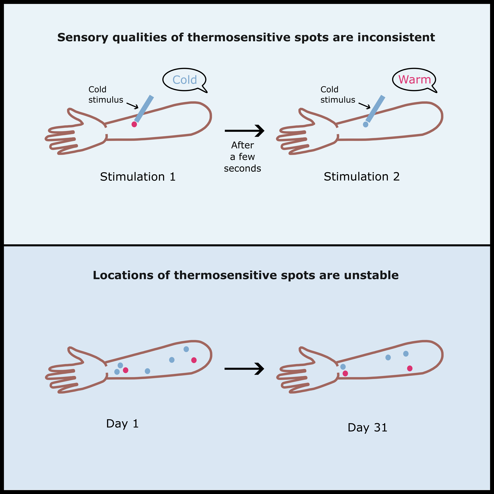

# Revisiting a classical theory of sensory specificity: assessing consistency and stability of thermosensitive spots

Publication in [Journal of Neurophysiology](https://journals.physiology.org/doi/full/10.1152/jn.00275.2023)

BioRxiv versions: [v1](https://www.biorxiv.org/content/10.1101/2023.07.17.549302v1) & [v2](https://www.biorxiv.org/content/10.1101/2023.07.17.549302v2)

Some data can be found in the [data/](data/) folder.

## Highlights
* Our skin's sensitivity to temperature is not uniform, but rather is highly concentrated in small regions called "thermosensitive spots".
* Cold spots are more common (34%) than warm spots (12%), and many spots (49%) elicited inconsistent sensations upon repeated stimulation.
* Surprisingly, only 4% of spots remain in the same location between sessions.
* Our findings challenge the traditional view that thermosensitive spots reflect the location of individual thermosensitive primary afferents serving as specific labelled lines for corresponding sensory qualities.

## Summary :page_with_curl:
Thermal sensitivity is not uniform across the skin, and is particularly high in small (~1mm2) regions termed ‘thermosensitive spots’. These spots are thought to reflect the anatomical location of specialised thermosensitive nerve endings from single primary afferents. Thermosensitive spots provide foundational support for “labelled line” or specificity theory of sensory perception, which state that different sensory qualities are transmitted by separate and specific neural pathways. This theory predicts a highly stable relation between repetitions of a thermal stimulus and the resulting sensory quality, yet these predictions have rarely been tested systematically. Here we present the qualitative, spatial and repeatability properties of 334 thermosensitive spots on the dorsal forearm sampled across 4 separate sessions. In line with previous literature, we found that spots associated with cold sensations (112 cold spots, 34%) were more frequent than spots associated with warm sensations (41 warm spots, 12%). Still more frequent (165 spots, 49%) were spots that elicited inconsistent sensations when repeatedly stimulated by the same temperature. Remarkably, only 13 spots (4%) conserved their position between sessions. Overall, we show unexpected inconsistency of both the perceptual responses elicited by spot stimulation and of spot locations across time. These observations call to revise the traditional view that thermosensitive spots reflect the location of individual thermosensitive, unimodal primary afferents serving as specific labelled lines for corresponding sensory qualities.

## Authors :man_scientist::woman_scientist:
- Ivan Ezquerra-Romano*
- Michael Clements*
- Steven di Costa
- Gian Domenico Iannetti
- Patrick Haggard

*Authors contributed equally

Contact: [ivan.ezquerra.romano@ucl.ac.uk](mailto:ivan.ezquerra.romano@ucl.ac.uk)

:key: **Keywords:** Thermosensation // Thermoception // Thermal spots // Primary afferents // Innervation

### Environment :computer::floppy_disk:
- Device: MacBook Pro (13-inch, 2019, Two Thunderbolt 3 ports)
- Operating system: macOS Monterey Version 12.4
- Programming languages: Python 3.8.6 & Arduino 1.8.19
